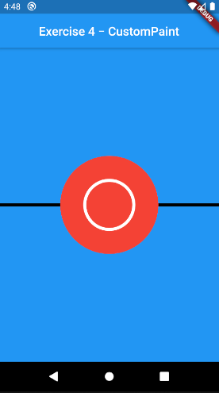

# CustomPaint

## ¿Qué permite hacer el widget CustomPaint?

Este widget permite dibujar diferentes formas y figuras personalizadas dentro de un canvas.

## ¿Cómo funciona?

Primero se inicializa el método _CustomPaint_.

```dart
CustomPaint(
    size: Size(200, 200),
    painter: MyPainter(),
    child: Container(height: 500),
)
```

Las propiedades principales de _CustomPaint_ son:

- **size**: si _child_ no está definido, se debe especificar el tamaño del canvas aquí.
- **painter**: dibuja en el canvas debajo del _child_.
- **child**: El canvas tomará el tamaño del _child_, si está definido.
- **foregroundPainter**: dibujará en la parte superior del _child_.

Luego el objeto _CustomPainter_ proporciona el canvas en el cual se dibujará. Este tiene 2 métodos:

- **paint()**: Este método tiene 2 parámetros, el _Canvas_ y el _Size_. Y es donde se dibujarán las formas o figuras en el canvas, se utiliza el objeto _Paint()_ para crear y personalizar (cambiando el color, estilo, tamaño, etc.) las formas o figuras.

- **shouldRepaint()**: Este método permite optimizar los repintados del canvas. Si retorna _false_ se utilizará el resultado anterior de pintura y si retorna _true_ entonces llamará a _paint()_, repintando el canvas.

```dart
class MyPainter extends CustomPainter {
    @override
    void paint(Canvas canvas, Size size){
    // TODO: implement paint
    }

    @override
    void shouldRepaint(CustomPainter old){
    // TODO: implement shouldRepaint
    return null;
    }
}
```

El objeto _Canvas_ tiene los métodos que permite dibujar las formas o figuras y todos estos requieren el objeto _Paint()_ para dibujar. Entre los métodos del objeto _Canvas_ tenemos a:

```dart
canvas.drawLine()
canvas.drawRect()
canvas.drawCircle()
canvas.drawArc()
canvas.drawPath()
canvas.drawImage()
canvas.drawImageNine()
canvas.drawParagraph()
```

## El sistema de coordenadas del canvas

Es sistema de coordenadas del canvas tiene su origen, el punto (0, 0), en la esquina superior izquierda del canvas, todos los dibujos comienzan a dibujarse desde ese punto.

## Ejemplos

Aquí vamos a dibujar un rectángulo, una linea, un circulo y una circunferencia.

Tenemos el siguiente _CustomPaint_:

```dart
CustomPaint(
    size: Size(300, 600),
    painter: MyPainter(),
    child: Container(height: 600),
    foregroundPainter: Circle(),
)
```

Se dibuja en el _canvas_ un rectángulo, sobre este se dibuja la linea y sobre los 2 anteriores se dibuja el circulo.

```dart
class MyPainter extends CustomPainter {

    @override
    void paint(Canvas canvas, Size size) {
        var paint = Paint();
        var center =
        Offset(size.width / 2, size.height / 2); // punto medio en el canvas

        // se dibuja un rectángulo
        paint.color = Colors.blue; // color de la figura
        var rect = Rect.fromLTWH(0, 0, size.width,
        size.height); // Se crea un rectángulo del mismo tamaño del canvas
        canvas.drawRect(rect, paint); // se dibuja el rectángulo

        //se dibuja una linea horizontal en la mitad del canvas
        paint.color = Colors.black; // color de la figura
        paint.strokeWidth = 5; // ancho de la linea
        Offset startingPoint = Offset(0, size.height / 2); // punto de inicio
        Offset endingPoint = Offset(size.width, size.height / 2); //punto final
        canvas.drawLine(startingPoint, endingPoint, paint); // se dibuja la linea

        //se dibuja un circulo
        paint.color = Colors.red; // color de la figura
        canvas.drawCircle(center, 80.0, paint); // se dibuja el circulo de radio 80
    }

    @override
    bool shouldRepaint(CustomPainter oldDelegate) {
        return false;
    }
}
```

Se dibuja en la parte superior del _child_ una circunferencia.

```dart
class Circle extends CustomPainter {
    @override
    void paint(Canvas canvas, Size size) {
        var paint = Paint();
        paint.color = Colors.white; // color de la figura
        paint.strokeWidth = 5; // ancho de la linea
        paint.style = PaintingStyle.stroke; // dibujar la circunferencia

        var path = Path(); // Este objeto permite dibujar una ruta personalizada
        path.addOval(Rect.fromCircle(
            center: Offset(size.width / 2, size.height / 2),
            radius: 40,
        )); // dibuja un ovalo de igual altura y anchura
        canvas.drawPath(path, paint);
    }

    @override
    bool shouldRepaint(CustomPainter oldDelegate) {
        return false;
    }
}
```


